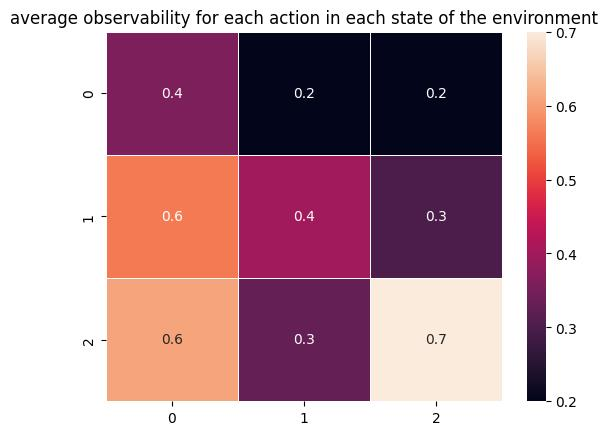
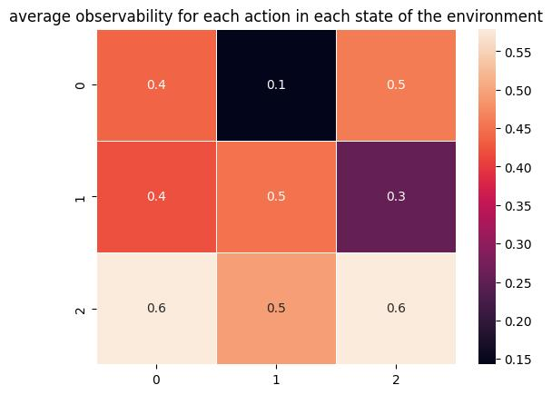
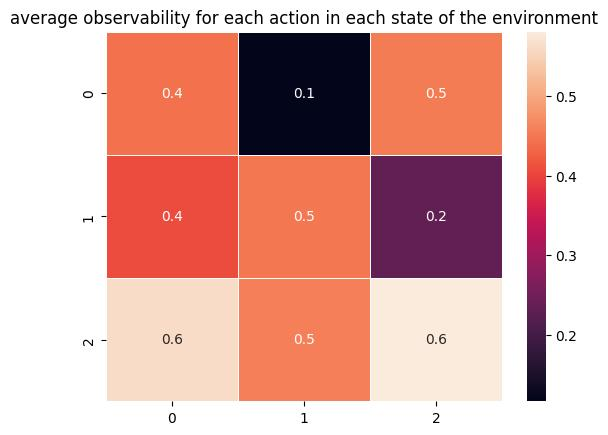
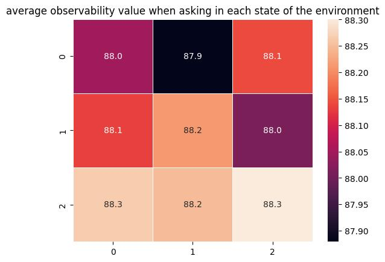
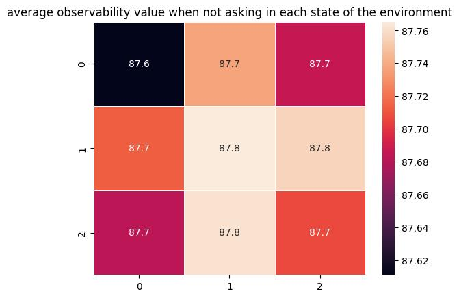

# Leveraging the presence of the monitor
A long description of this experiment.
1. Why am I trying to leverage the existence of the monitor, and how?
2. What are my goals?
3. How does this tie into the larger project?

**answers**:
1. Because it can accelerate the learning of the agent. Meaning that the exploration would be done faster.
   1. If the monitor was known, then the agent could have a more focused attempts i.e., forgoing the never-observable state-action pairs and perseverance with respect to partially observable state-action pairs until its estimation of the behavior of the monitor matches the prior information.
2. My goal is to identify the behavior of the monitor before the learning wit respect to the system begins.
3. By achieving this goal, we improve the sample efficiency of exploration in Mon-MDPs compared to the previous works.

## Hypothesis
- What do I expect will happen?
What does success look like, and how do I measure that?

**answers**:
- I expect that the agent has no uncertainty around the probability of seeing the reward at the end of exploration mode so does have identified the monitor.
- The success would be having an accurate estimate of the probabilities of monitor for each state-action pair.
- I compare the observability probabilities with the ground truth priors

## Open Questions
1) When should the exploration-exploitation happen? $\log{t} / N \geq \beta$ where $t$ is the number of episodes and $N$ the number of exploration episodes?
   1. should it be stepwise?
   2. should it be with respect to the least observed pair?
2) The agent can turn the monitor on but once it's on how does it help with identifying the monitor?

## Follow-up Questions

## Trials

### Failures

#### Code: 
- Date:   Sun Aug 11 11:05:32 2024 -0600
- Short Hash: a3e9c0e

| environment | monitor | obs prob | total episodes | exploration episodes | $\beta$ |
|-------------|---------|----------|----------------|----------------------|---------|
| grid_det    | Ask     | 0.6      | 401            | 6                    | 1       |
| grid_det    | Ask     | 0.6      | 402            | 62                   | 0.1     |
| grid_det    | Ask     | 0.6      |     402        | 401                  | 0.01    |

##### Configs
- gamma: 0.99
- joint_max_q: 10
- obsrv_max_q: 100
- env_min_r: -10
- mon_max_r: 0
- ucb_re: 0.004
- ucb_rm: 0.004
- ucb_p: 0.004

##### Outcome

- $\beta = 1$

- $\beta = 0.1$

- $\beta = 0.01$

#### Conclusion
1- $\beta = 1$ give a good balance for the exploration-exploitation balance.

2- The code seems problematic because there are cells that the monitor is not identified well specifically, cells 0, 3, 4 and 5.

**Further Analysis on $\beta = 0.1$**

### Success

## Results